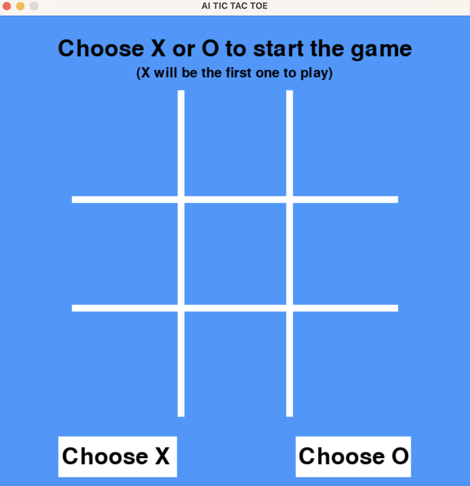
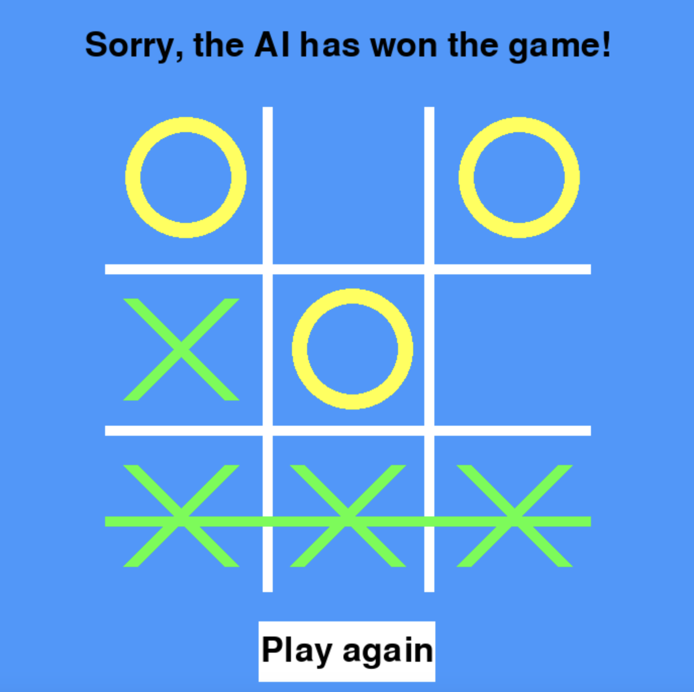
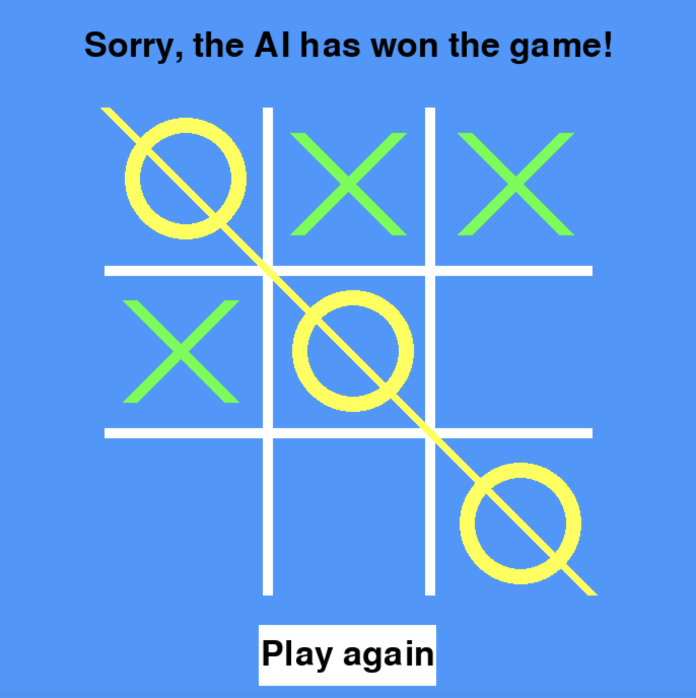
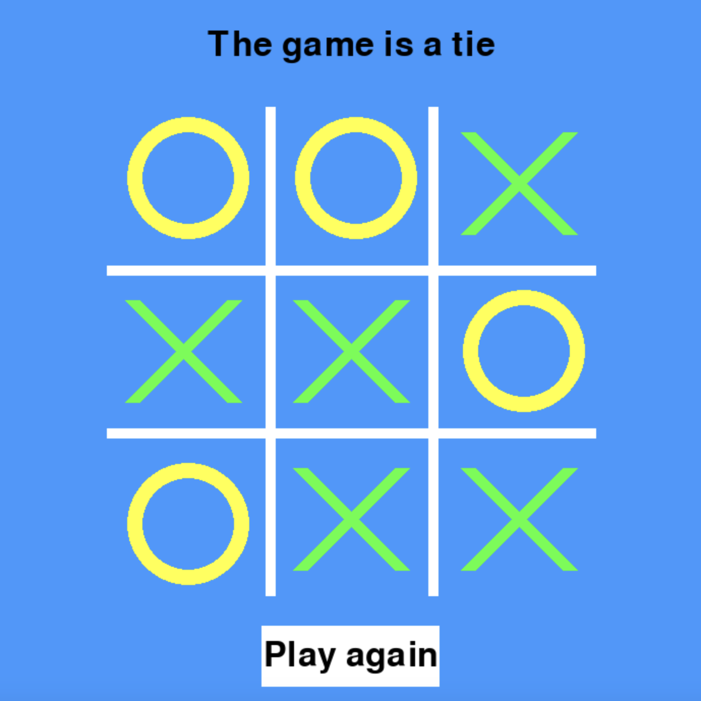
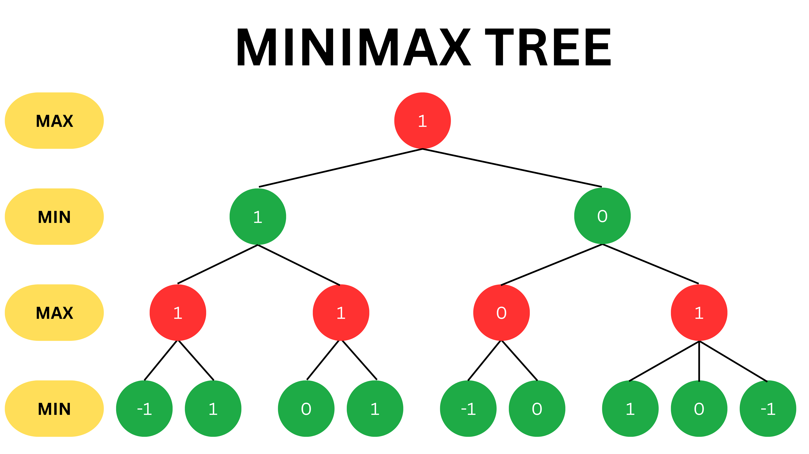

# AI Tic Tac Toe

## Introduction

AI Tic Tac Toe is the widely-known Tic-Tac-Toe game in which two players take turns marking a square with their symbol, either "X" or "O" with the goal of being the first to create a line of three with their symbols either horizontally, vertically, or diagonally. However, what is special about this Tic Tac Toe game is that instead of two people playing, one person plays against an AI program that will do its best to win the game. Therefore, the best case scenario is that the player will tie the game, but he or she will not be able to win against the AI.

<div align="center">
    
</div>

## Description

In AI Tic Tac Toe, the user chooses a symbol, either an "X" or "O". Since "X" always starts the game, if the user chooses "X" he or she will begin, otherwise the AI will begin. Playing the game is very simple: the user chooses an empty space inside the grid by clicking on the mouse, and the symbol will be placed there. Then user then waits for the AI to make its move and place a symbol. This event will repeat until there is a winner or the game ends in a tie because there are no more empty spaces available. If there is a winner before the game ends in a tie, the program will notice it and mark the line that the winner formed. After the game finishes, the user will have the option to play the game again. 

<div align="center">
    
</div>

<div align="center">
    
</div>

<div align="center">
    
</div>

## Graphical User Interface (GUI)

Because Tic-Tac-Toe is a simple game, the tools available in the Pygame library were enough to make this game's GUI. However, there are more sophisticated options available to make a better looking GUI such as Tkinter or PyQT5!

## AI logic

The most challenging part of this game was to code an AI program that checks all the possible scenarios that could happen in the game board and pick the best choice available. Here, the best choice available means that the AI wins the game or if that is not possible at least ends the game in a tie. 

The concept behind the AI's thought process is called "Minimax", which is a famous decision making algorithm used in artificial intelligence. The minimax concept is used in two-player games such as chess or tic-tac-toe and aims to find the optimal strategy for a player by considering all possible moves and their outcomes. The following is the Minimax Tree with its explanation of how it applies
to this game:

<div align="center">
    
</div>


* Game Tree: The minimax algorithm creates a game tree that represents all possible moves and their results. In this game, +1 represents that X wins, 0 represents a tie, and -1 represents that O wins.

* Recursive Evaluation: The algorithm recursively evaluates each possible move by assuming that both players (X and O) make the best choices to maximize their chances of winning or forcing a draw. It alternates between maximizing (Max) and minimizing (Min) the potential outcomes.

* Final result: At the leaf nodes of the tree (i.e., game states where someone wins or it's a draw), the algorithm assigns scores:
If "X" wins, the score is +1.
If "O" wins, the score is -1.
If it's a draw, the score is 0.

* Backtracking: As the algorithm explores the game tree, it backtracks and assigns scores to each possible move based on the assumed optimal play by both players.

* Optimal Move: Finally, the algorithm chooses the move that leads to the highest score if it's "X"'s turn (Maximizing player) or the move that leads to the lowest score if it's "O"'s turn (Minimizing player). This move is considered to be the best move to make in the current state.

## Clone the project and play the game

To clone the project and play the game, the user can do the following:

1. Clone this repository to the local machine

2. Install the required libraries through the following command:

    ```bash
    pip install -r requirements.txt
    ```
    

3. Run the game by typing the following in the terminal:

    ```bash
    python game.py
    ```


4. Congratulations, you are ready to play the game!

## Credits
 
This project was inspired by Harvard's CS50 AI course on Edx. One of the assignments was to make part of the backend code for an Ai Tic-Tac-Toe game that already had the front end written as well as the guidelines of which functions were missing to make the game work. After completing the task, I decided to make the game from scratch and implement the backend code that I had already written to make the whole game on my own.

## Contributions

This application was made as a personal project and does not accept contributions. However, users can feel free to clone the repository and use or modify it according to their own needs.

## License

This project is under the terms of the [MIT license](https://opensource.org/license/mit/)